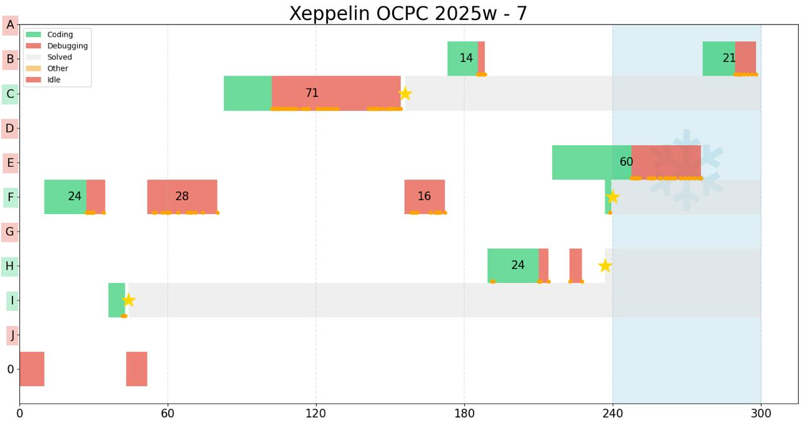

# Xeppelin Contest Watcher

Xeppelin is a contest watcher software that keeps track of file modifications during a contest and creates visualizations of your activity.

## Installation

```
pip install xeppelin
```



## Workflow

1. Prior to the contest, create a new contest directory. Let's say it's called icpc-wf.
2. Run `xeppelin start icpc-wf` to start watching the directory.
3. Start the contest by writing a template file. Xeppelin team uses `template.cpp`.
4. When solving a problem, create a new file with the problem letter. For example, if you're solving problem A, create a file named `A.cpp`.
5. When you compile the code, use `-o` flag to specify the problem letter. For example, `g++ A.cpp -o A`.
6. After the contest, run `xeppelin stop icpc-wf` to stop watching the directory.
7. Looking through your submissions, you can see the time of each successful submission. Add them manually to the log file with `xeppelin log icpc-wf "A solved 1:30"`.
8. Run `xeppelin show icpc-wf` to see the visualization and get the image on your disk.

## Commands

- **Initialize a contest**: `xeppelin init <name> <last_problem> [--template PATH]`

  Creates the contest directory, copies `template.cpp` into it, creates problem files
  from `A.cpp` through the given letter, adds `input.in`, `output.out`, and
  `stress.py`, then starts the watcher. The command fails if the directory exists.

  ```
  xeppelin init icpc-wf E
  xeppelin init regional H --template ~/templates/contest.cpp
  ```

- **Compile a problem**: `xeppelin compile <problem> [--no-debug] [--no-sanitize]`

  Compiles `<problem>.cpp` with C++17, optimization, debug symbols, `DEBUG`, and
  undefined-behavior, bounds, and address sanitizers by default.

- **Run a problem**: `xeppelin run <problem> [--no-compile] [--no-debug] [--no-sanitize]`

  Compiles by default, reads from `input.in`, and writes to `output.out`.

- **Run with Edulcni**: `xeppelin edulcni <problem> [options]`

  Compiles the problem with Edulcni instrumentation, starts the native viewer,
  streams frames while the solution runs, and keeps the viewer open for
  previous/next navigation after the solution exits. Ordinary `compile` and
  `run` commands do not include or link Edulcni.

  In a source checkout next to the Edulcni repository, Xeppelin discovers
  `../edulcni` automatically. Otherwise set `EDULCNI_ROOT` or pass
  `--edulcni-root`. The built viewer and `libedulcni` must be present below
  that root; `--viewer`, `--include-dir`, and `--library-dir` can override
  individual paths.

  ```
  xeppelin edulcni A
  xeppelin edulcni A --input sample.in --output sample.out
  xeppelin edulcni A --edulcni-root /path/to/edulcni
  ```


- **Stress test**: `xeppelin stress <solution> <brute> <generator>`

  Compiles the three corresponding C++ sources with sanitizers enabled and
  `DEBUG` omitted, then runs them until the solution and brute-force outputs
  differ. On failure it saves `input.in`, `output.out`, and `expected.out`.

- **Start Watching**:   ```
  xeppelin start <contest_name>  ```
  Starts watching the current directory for file modifications and logs them to `<contest_name>.log`.

- **Stop Watching**:   ```
  xeppelin stop <contest_name>  ```
  Stops watching for the specified contest.

- **Show Visualization**:   ```
  xeppelin show <contest_name> [--duration MINUTES] [--freeze TIME]  ```
  Displays a visualization of the activities logged for the specified contest.
  
  Options:
  - `--duration MINUTES`: Sets the maximum time (in minutes) to show on the visualization axis (default: 300)
  - `--freeze TIME`: Adds a freeze period indicator starting at specified time (format: HH:MM or minutes)
  
  Examples:
  ```
  xeppelin show icpc-wf --duration 240
  xeppelin show icpc-wf --freeze 4:00
  xeppelin show icpc-wf --duration 240 --freeze 180
  ```

- **Log Submissions**:   ```
  xeppelin log-submissions <contest_name> <submission_info>  ```
  Adds additional submission information to the log file for the specified contest.
  Usually should be used to log the time of the submission.
  Example:
  ```
  xeppelin log-submissions test "A solved 1:30"
  ```

- **Help**:   ```
  xeppelin --help
  xeppelin <command> --help  ```
  Shows help information about Xeppelin commands and their options.

## Format

All problems are coded in files named `A.cpp`, `B.cpp`, etc.
The compiled binary is named `A`, `B`, etc.
Some additional files for the contest (stress-testing, additional solutions, etc.) are also allowed, if their filename starts with letter that matches the problem letter.

## Requirements

- Python 3.9 or newer.
- Python packages: `pandas`, `matplotlib`, `numpy`, `watchdog`.

File watching is supported on macOS, Linux, and Windows through `watchdog`.


## Contributing

Contributions are welcome! Please feel free to submit a pull request. In the ideal scenario, the feature should be optional and could be turned on/off with a flag.

## License

This project is open-sourced under the MIT License - see the LICENSE file for details.
